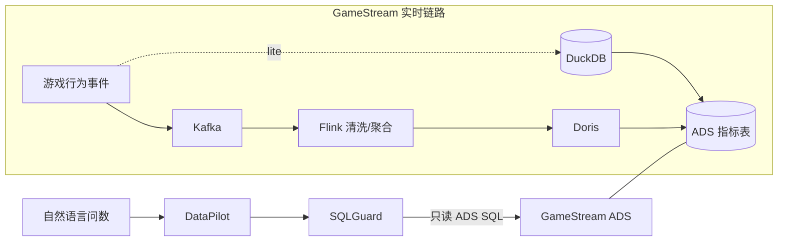

# SQLGuard

[](https://github.com/tangyf07/SQLGuard/actions/workflows/ci.yml)
[](https://github.com/tangyf07/SQLGuard/releases/latest)
[](https://www.python.org/downloads/)
[](LICENSE)

**SQLGuard**（仓库 [`tangyf07/SQLGuard`](https://github.com/tangyf07/SQLGuard)；PyPI/CLI 包名仍为 `sql-write-gate`）= 面向 AI Agent / Text2SQL 出站路径的 **确定性 SQL 安全执行网关**。Complements [RetailDW](https://github.com/tangyf07/RetailDW) / [GameStream](https://github.com/tangyf07/GameStream) as the data-consumption safety layer.

## Why

Agent / Text2SQL 会对仓表直接发 SQL。错误 JOIN、PII 写入、schema 幻觉、过期分区写回等，不能靠模型自觉。需要执行前的确定性 `ALLOW` / `BLOCK`（及必要时人工审批），且**判定路径不引入 LLM**。

## Architecture

- [RetailDW](https://github.com/tangyf07/RetailDW) / [GameStream](https://github.com/tangyf07/GameStream)（仓表 / 指标 ADS）— 数据开发主线
- [DataPilot](https://github.com/tangyf07/DataPilot)（问数 → Text2SQL → 出站门禁）
- 本仓：SQLGuard 执行前 BLOCK / EXECUTE



Deterministic policy engine (sqlglot AST + catalog + policy.yaml). **No LLM. No API key.**

## Guarantees

在已声明 **support matrix** 上（**pilot-ready**：DuckDB / PostgreSQL / MySQL / SQLite + 已列 SQL / 入口）：

- 确定性 `ALLOW` / `BLOCK` / `REQUIRE_APPROVAL`，带 `rule_id` + evidence
- 未列 / 歧义 SQL → fail-closed `unsupported_sql`（从不静默当只读 ALLOW）
- Seal 四案稳定：legal→ALLOW/ok · PII→BLOCK/pii_column · schema→BLOCK/schema_hallucination · expired→BLOCK/expired_partition
- **HTTP `serve` server-locked（P0）**：`--policy` / `--catalog` / `--database` / environment 在进程启动时绑定；请求体不得覆盖（覆盖 → `400 trust_boundary_violation`）
- **Audit SQL 默认脱敏**：`SQL_WRITE_GATE_AUDIT_SQL_MODE=redact`（可 `hash` / `plain`）
- **Trusted executor**：`approve` / `resolve` / `reject` 需 `SQL_WRITE_GATE_APPROVAL_TOKEN`（密钥文件默认 `.logs/approval.key` / `SQL_WRITE_GATE_APPROVAL_KEY_FILE`）

**非生产唯一边界 / 非唯一边界** — **not** the sole production DB security boundary. Combine with least-privilege DB roles, network isolation, and human workflows.

## Quickstart

```bash
pip install -e ".[dev]"                 # or: make install
make seal                               # 4 core ALLOW/BLOCK cases (~3 min)
```

```bash
sql-write-gate check "DELETE FROM orders"
# → BLOCKED  rule=delete_without_where
```

Stable CLI entrypoints: `check` · `hook` · `mcp` · `proxy` · `approve` · `audit`（详情见 [docs/api.md](docs/api.md)；安装见 [docs/install.md](docs/install.md)）。

## Evidence

`make seal` 固定跑 4 个核心用例，stdout 打印 `ALLOW`/`BLOCK` + `rule_id` + evidence。详情与截图：[SEAL.md](SEAL.md)。

| # | Case | Verdict | rule_id |
|---|------|---------|---------|
| 1 | legal write | ALLOW | `ok` |
| 2 | PII write | BLOCK | `pii_column` |
| 3 | schema mismatch | BLOCK | `schema_hallucination` |
| 4 | expired partition | BLOCK | `expired_partition` |


## Design decisions

- **判定不含 LLM** — sqlglot AST + catalog + `policy.yaml`；不引入模型裁判，避免门禁本身不可复现。
- **HTTP 信任边界在 serve 启动时锁定（P0）** — policy / catalog / database / env 属进程配置；body 仅 `sql` / `actor` / `model_id` / `prompt_summary`。非 loopback / `0.0.0.0` 须 `--auth-token` / `SQL_WRITE_GATE_HTTP_TOKEN`。
- **审计默认 redact** — JSONL 审计对 SQL 字面量默认脱敏，降低日志侧泄露面（`redact|hash|plain`）。
- **Trusted executor** — DB 凭证、`approve`/`resolve`/`reject` 与 policy 改写权留在受信执行侧；Agent 面只评估 / 入队。
- **Fail-closed** — 未列语法、歧义写形态、估计失败、缺 flock 等拒绝执行，不静默降级为 ALLOW。

## Limitations

- **非生产唯一边界 / 非唯一边界** — 须与最小权限 DB 角色、网络隔离、人工流程并用
- 仅声明 support matrix：DuckDB / PostgreSQL / MySQL / SQLite + 已列 SQL；未列语法 → `unsupported_sql`
- 不是分布式审批锁、MySQL wire 代理、Web UI、企业 DQ/血缘/多租户平台
- 非 loopback / `0.0.0.0` 的 HTTP `serve` 须显式 token（见 [docs/api.md](docs/api.md) Trust boundary）
- GitHub Latest Release 可能滞后 `main`；以包版本 / commit 为准
- 单机审批依赖 Unix `fcntl.flock`；**Windows** 上审批变更 **fail closed**（`ApprovalError`，不静默解锁）
- 连接可用 `POSTGRES_URL` / `MYSQL_URL` / `DATABASE_URL`（见 [docs/support-matrix.md](docs/support-matrix.md)）

See also: [docs/install.md](docs/install.md) · [docs/api.md](docs/api.md) · [docs/support-matrix.md](docs/support-matrix.md) · [docs/troubleshooting.md](docs/troubleshooting.md) · [docs/compatibility.md](docs/compatibility.md) · [docs/pilot-checklist.md](docs/pilot-checklist.md) · [CHANGELOG.md](CHANGELOG.md) · MIT [LICENSE](LICENSE)
