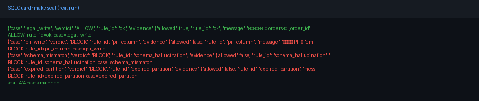

# SQLGuard seal (3 minutes)

**What:** Deterministic SQL write gate for AI agents — ALLOW/BLOCK with rule_id + evidence. No LLM.



**One command:**

```bash
make seal
```

**Expected 4 outcomes (stable order):**

| # | Case | Verdict | rule_id |
|---|------|---------|--------|
| 1 | legal write | ALLOW | `ok` |
| 2 | PII write | BLOCK | `pii_column` |
| 3 | schema mismatch | BLOCK | `schema_hallucination` |
| 4 | expired partition | BLOCK | `expired_partition` |

Stdout prints `ALLOW` or `BLOCK`, `rule_id`, and structured evidence JSON. Non-zero exit on mismatch.

**Boundary (honest):** 非生产唯一边界 — not the sole production DB security boundary. Pair with least-privilege DB roles, network isolation, and human review. Broader demo: `make demo`. DataPilot contract wording stays BLOCK / EXECUTE.